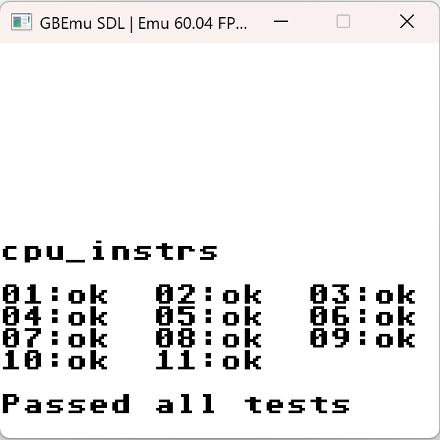
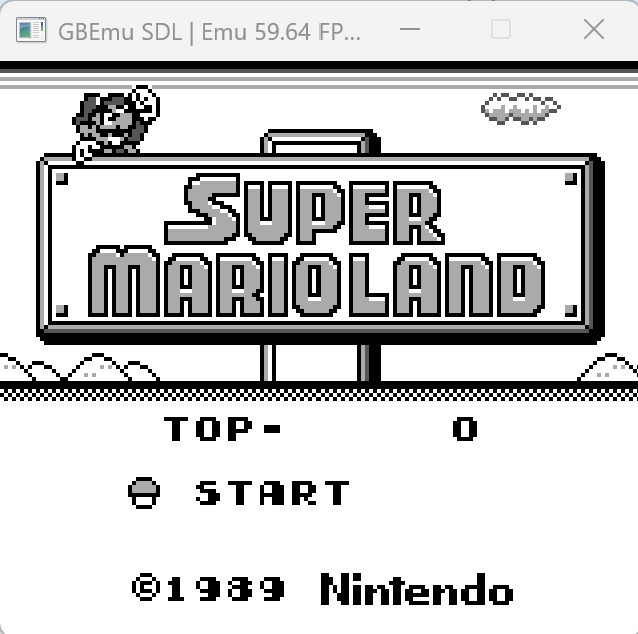
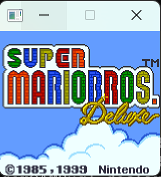
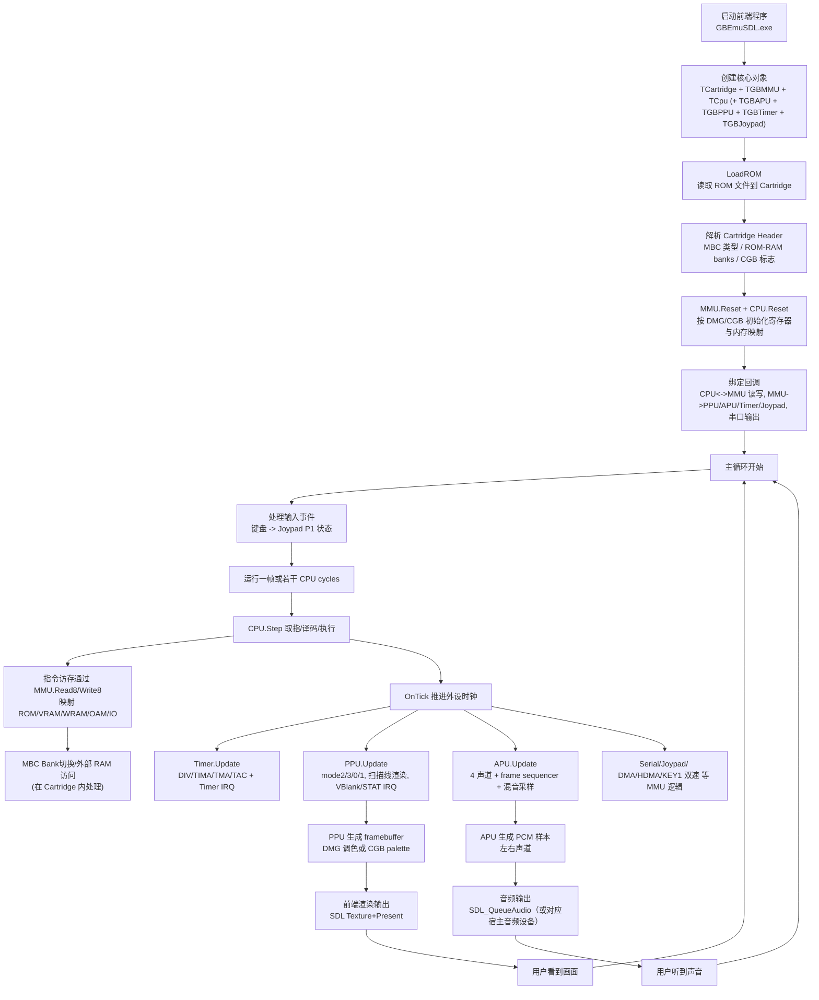
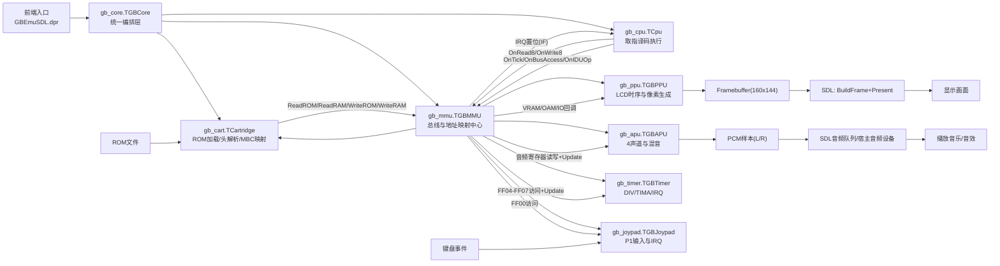

# LiangliangGBC
A GameBoy/GameBoy Color emulator written in Pascal(Delphi).

  

**Controls:**
- **W/A/S/D**: Up/Left/Down/Right
- **Z/X**: Select/Start
- **J/K**: Button A/B

**Compiler：**
- **Windows(Delphi)**: dcc32 -B -Q .\GBEmuSDL.dpr

**Run:**
- **Windows**: .\GBEmuSDL.exe '.\Super Mario Bros. Deluxe (Japan) (NP).gbc' --scale=3
- **Set Window Size(Default=1)**: --scale=4
- **Set Screen Linear filtering(>2x window,Default --linear)**: --linear / --nearest

**模拟器流程**

**代码流程**

